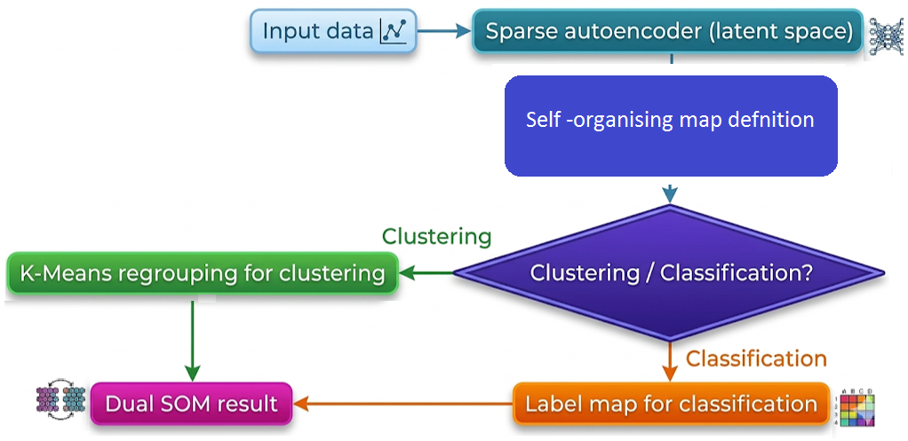

# DualSOM: Dual-mode software for clustering and classification using Self-Organising Map

**Authors:** Vibekananda Dutta¹², Teresa Zielinska², Xin He¹², Takafumi Matsumaru¹, Robert Sitnik²

¹ *Waseda University, Japan* ² *Warsaw University of Technology, Poland*


## 📖 Table of Contents

* [Introduction](#introduction)
* [Key Features](#key-features)
* [30-Second Quick Start](#quick-start)
* [Network Architecture](#network-architecture)
* [How the System Works](#how-the-system-works)
* [System Requirements](#system-requirements)
* [Installation Guide](#installation-guide)
* [Data Preparation](#data-preparation)
* [Configuration (`params.json`)](#configuration)
* [Execution and Caching](#execution-and-caching)
* [Cluster Number Selection (`Selection.py`)](#optimal-cluster-selection)
* [Benchmarking with Generic Datasets](#benchmarking-with-generic-datasets)
* [Example Results](#example-results)
* [Limitations](#limitations)
* [Note on Reproducibility](#reproducibility)
* [API Reference](#api-reference)
* [Reference](#reference)
* [License](#license)

---

## <a id="introduction"></a>✨ Introduction

DualSOM is an open-source, general-purpose software framework for **unsupervised clustering** and **supervised classification** of high-dimensional data within a unified pipeline. The framework combines sparse autoencoding for dimensionality reduction with a self-organising map (SOM) trained using distance-based learning.

The novelty of this software is not a new algorithm, but a unified execution framework where the *same trained SOM representation* is reused for both clustering and classification without retraining or architectural changes.

A central feature of DualSOM is its **dual-mode operation**, which enables seamless transition between clustering and classification without modifying the model structure. The same trained representation and SOM grid can be used for exploratory data analysis or for label-based recognition, ensuring consistency and reproducibility across tasks.

The software is designed as a **modular and extensible system**, allowing users to configure latent dimensionality, SOM topology, learning schedules, neighbourhood functions, and distance metrics. This flexibility makes it applicable to a wide range of domains involving structured or high-dimensional data, including robotics, human–computer interaction, and multimodal perception.

The framework is domain-independent; however, it has been **demonstrated on human posture recognition from RGB-D skeletal data**, following our previous work published in RA-L 2024 [[1]](#reference) and presented in ICRA-2025. In this context, posture recognition serves as an example application rather than the primary scope of the software.

## <a id="key-features"></a>🚀 Key Features

* **Dual-mode learning (clustering and classification)**
  A unified framework that supports both **unsupervised clustering** and **supervised classification** within the same model, without requiring any structural changes.
* **Shared representation and model reuse**
  The same latent representation and trained self-organising map (SOM) are used for both modes, enabling seamless transition from exploratory analysis to recognition tasks.
* **Dimensionality reduction via sparse autoencoder**
  High-dimensional input data are transformed into compact and informative latent representations, reducing computational complexity while preserving essential structure.
* **Flexible self-organising map (SOM)**
  Configurable SOM architecture with support for different grid sizes, initialization strategies, and **user-defined distance metrics**, allowing adaptation to diverse data types.
* **Automatic clustering capability**
  Built-in mechanism for selecting the optimal number of clusters from a user-defined range using a modified K-Means approach applied to SOM neurons.
* **Supervised label mapping for classification**
  Efficient classification through neuron-based label maps, where each neuron stores class information derived from training samples.
* **Modular and extensible design**
  Clearly separated components (data handling, encoding, SOM training, post-processing) enable easy customization, extension, and integration into larger systems.
* **Reproducible and configurable pipeline**
  All key parameters (latent dimensionality, learning rates, neighbourhood functions, distance metrics) are explicitly configurable, ensuring reproducibility across experiments.
* **Real-time and low-complexity operation**
  Designed with computational efficiency in mind, making the framework suitable for real-time or resource-constrained applications.
* **Application-independent framework**
  Although demonstrated on human posture recognition from skeletal data, the software is applicable to any structured or high-dimensional dataset, including sensor data, motion capture, and multimodal inputs.

## <a id="quick-start"></a>⏱️ 30-Second Quick Start

Get the pipeline up and running immediately with default configurations:

```bash
git clone https://github.com/qqwwqwq/DualSOM--SOFTWAREX-.git
cd DualSOM--SOFTWAREX-
pip install -r config/requirements.txt
python prepare_mnist.py
python main.py
```


https://github.com/user-attachments/assets/06ae1fd4-11b1-4001-b436-1df0a0b392f8


## <a id="network-architecture"></a>🕸️ Outline of Method

<p align="center">
  
</p>

## <a id="how-the-system-works"></a>⚙️ How the System Works

DualSOM is designed as a flexible framework for human posture and activity recognition, supporting both **supervised classification** and **unsupervised clustering**. The system combines a **Sparse Autoencoder (SAE)** for feature extraction with an **Extended Self-Organizing Map (SOM)** for structured data representation and clustering.

### 1. Sparse Autoencoder (SAE)
* **Purpose:** Reduces high-dimensional input data (e.g., skeleton coordinates) to a compact latent representation while preserving essential spatial and relational information.
* **Operation:** Takes raw or preprocessed feature vectors as input and learns an embedding that captures meaningful patterns in the data.
* **Output:** Latent features that serve as input to the DualSOM.

### 2. DualSOM
* **Core Component:** An Extended Self-Organizing Map that processes latent features.
* **Functionality:**
  * **Supervised Mode:** Maps neurons to known class labels, enabling accurate posture classification and evaluation using standard metrics (Accuracy, F1, Precision, Recall).
  * **Unsupervised Mode (Algorithm 2):** Performs K-Means-style regrouping of SOM neurons using angular distance, enabling clustering without labels. Clustering quality is evaluated with metrics like NMI, AMI, Homogeneity, and Completeness.

### 3. Two Training Modes
* **Standard Mode:** Periodic validation is performed during SOM training, producing an accuracy curve to monitor learning progress.
* **Fast Mode:** Skips validation checks for quicker execution, suitable for large datasets or rapid experimentation.

### 4. Data Flow
1. **Load Data:** Reads tabular input data (.csv), optionally with labels.
2. **Preprocess:** Normalizes features, imputes missing values, and encodes labels (if available).
3. **Feature Extraction:** Sparse Autoencoder transforms data into latent space.
4. **SOM Training:** DualSOM organizes latent features onto a 2D map, learning topology-preserving representations.

## <a id="system-requirements"></a>💻 System Requirements

### 1. Software Requirements
* **Python:** 3.7 (recommended)
* **Python Libraries:**
  * `torch >= 1.13.1` (CUDA 11.7 supported)
  * `numpy >= 1.21.6`
  * `pandas >= 1.3.5`
  * `scikit-learn >= 0.24.2`
  * `matplotlib >= 3.5.3`
  * `scipy >= 1.4.1`
  * `tqdm >= 4.65.2`
  * `PyQt5>=5.15.10`

### 2. Hardware Requirements
* **CPU:** Standard multi-core processor 
* **RAM:** Minimum 8 GB (16 GB recommended for large datasets)
* **GPU (optional):** CUDA-compatible GPU recommended for faster Sparse Autoencoder training (recommended)

### 3. Operating Systems
* Linux (recommended)

### 4. Input Data Requirements
* Tabular format (e.g., `.csv`)
* Each sample represented as a feature vector
* Optional labels for supervised classification mode

### 5. Notes
* GPU acceleration is only required for efficient training on large datasets; the framework can run entirely on CPU.
* The software is designed to be lightweight and can operate on moderate hardware for small to medium datasets.
* Performance depends primarily on dataset size, latent dimensionality, and SOM grid configuration.

---

## <a id="installation-guide"></a>🛠️ Installation Guide

Follow these steps to set up DualSOM on your system.


### 1. Create a Python Environment

It is highly recommended to use `conda` to isolate dependencies. This project is optimized for Python 3.7:

**Using conda:**
```bash
conda create -n dualsom python=3.7 -y
conda activate dualsom
```

### 2. Clone the Repository

```bash
git clone https://github.com/qqwwqwq/DualSOM--SOFTWAREX-.git
cd DualSOM--SOFTWAREX-
```

### 3. Install Dependencies (Includes GPU Support)

Install the required Python packages using `pip`. 
*Note: The `requirements.txt` is pre-configured to automatically download PyTorch with **CUDA 11.7** support for hardware acceleration.*

```bash
pip install --upgrade pip
pip install -r config/requirements.txt
```

### 4. Verify Installation

Run a quick test to confirm the environment is correctly set up and can successfully communicate with your GPU:

```bash
python -c "import torch, numpy, pandas, matplotlib; print('Environment OK. CUDA Available:', torch.cuda.is_available())"
```

---

## <a id="data-preparation"></a>📂 Data Preparation

### 📊 Input Data Format
The model pipeline expects datasets to be in standard **CSV format** (headers are fully supported).

**Using Custom Datasets:**
If you are using your own CSV data, ensure it strictly follows this structure:
* **Rows:** Individual data samples.
* **Columns [0 to N-1]:** Numerical input features.
* **Last Column [N]:** The Target label. 
  * ✨ **Auto-Factorization:** String/Text labels (e.g., "Normal", "Anomaly") are fully supported and will be automatically converted to numerical IDs during ingestion.
  * ⚠️ **Unsupervised Note:** The data loader **always** extracts the last column as the label. Even if you are running in strictly `'unsupervised'` mode with unlabeled data, **you must include a dummy column at the end** (e.g., filled with zeros) to prevent your last feature column from being accidentally stripped.

---

### Tested Datasets
Our framework is highly flexible. It supports standard vectorized data (`.npy`, `.csv`) and has built-in pipelines specifically tailored and evaluated on:

Two skeleton-based human posture datasets:
* **WUT** (Warsaw University of Technology Dataset)
* **PKU-MMD** (Peking University Dataset)

One image dataset:
* **MNIST** (Standard benchmark dataset of 28x28 grayscale handwritten digits)

One signal dataset:
* **FordA** (Automotive engine noise and vibration sensor time-series dataset from the UCR archive)
  
### 1. Download Datasets
* **WUT Dataset**: Download the skeleton-only dataset from [this link](https://drive.google.com/file/d/1vUCRI8ATVbDu3JsYGfgnVNJaAfNMwRVW/view?usp=drive_link).
* **PKU Dataset**: Download the skeleton-only dataset from [this link](https://drive.google.com/file/d/1HsPPiyzpjIvDHAeqR-qqa40qJgRjaG4D/view?usp=sharing).
* **MNIST Dataset**: Run `python prepare_mnist.py` to automatically download, normalize, and format the image data into compatible CSV files.
* **FordA Dataset**: Run `python prepare_forda.py` to automatically download and process the 1D sensor time-series data into compatible CSV files.

### 2. Directory Structure
After downloading and extracting (or preparing your custom data), please arrange the raw data into the following directory structure before training:

```text
DualSOM/
├── Datas/
│   ├── WUT/
│   │   ├── train_data.csv        # Preprocessed training features & labels
│   │   └── test_data.csv         # Preprocessed testing features & labels
│   ├── PKU/
│   │   ├── train_data.csv        # Preprocessed training features & labels
│   │   └── test_data.csv         # Preprocessed testing features & labels
│   ├── MNIST/
│   │   ├── train_data.csv        # Preprocessed training features & labels
│   │   └── test_data.csv         # Preprocessed testing features & labels
│   └── FordA/
│       ├── train_data.csv        # Preprocessed training features & labels
│       └── test_data.csv         # Auto-generated label mapping
├── Dualmap.py                    # Core mathematical SOM and clusterer
├── sparse_autoencoder.py         # PyTorch Mini-Batch Autoencoder module
├── preprocessing.py              # Data ingestion and generic loader
├── main.py                       # Main 5-stage execution pipeline
├── Selection.py                  # Tool for finding the optimal cluster number
├── params.json                   # All-in-one configuration file
└── weight/                       # Auto-generated directory for cached models
    ├── sparse_ae.pth
    └── som_weights.npy
```

---

## <a id="configuration"></a>⚙️ Configuration (`params.json`)

To enforce **Safe Configuration Management**, the pipeline splits hyperparameters into two groups. Only the high-level workflow choices and tuning knobs are exposed in the `params.json` file. 

Below is the complete template reflecting the latest version of the framework. We utilize `_comment_` dummy keys to provide in-line documentation without breaking JSON parsers:

```json
{
    "dataset_name": "mnist",
    "run_mode": "supervised",
    "device": "cuda",
    "train_data_path": "Datas/MNIST/train_data.csv",
    "test_data_path": "Datas/MNIST/test_data.csv",
    "som_load_model": false,
    "som_model_path": "weight/som_weights.npy",
    "ae_load_model": false,
    "ae_model_path": "weight/sparse_ae.pth",
    "auto_find_clusters": false,
    "k_min": 2,
    "k_max": 12,
    "n_clusters": 10,
    "ae_epochs": 150,
    "som_epochs": 50,
    "activation_distance": "angular"
}
```

### Parameter Dictionary

#### 1. User-Configurable Parameters (via `params.json`)
These parameters represent high-level workflow choices and training iterations specific to your dataset and hardware constraints.

| Parameter | Type | Description | Suggested Value / Range |
| :--- | :--- | :--- | :--- |
| `dataset_name` | String | Target dataset identifier. | `'wut'`, `'pku'`, `'mnist'`, etc. |
| `run_mode` | String | Execution mode. | `'supervised'` or `'unsupervised'` |
| `device` | String | Hardware acceleration target. | `'cuda'` or `'cpu'` |
| `train_data_path` | String | Local path to the training CSV file. | - |
| `test_data_path` | String | Local path to the testing CSV file. | - |
| `som_load_model` | Bool | Bypass SOM training and load pre-trained weights. | `true`, `false` |
| `som_model_path` | String | Filepath for saving/loading the SOM weights (`.npy`). | - |
| `ae_load_model` | Bool | Bypass SAE training and load pre-trained SAE weights. | `true`, `false` |
| `ae_model_path` | String | Filepath for saving/loading SAE weights (`.pth`). | - |
| `auto_find_clusters`| Bool | Dynamically calculate optimal $K$ based on $\Delta L$. | `true`, `false` |
| `k_min` | Int | Lower bound for automated number ($K$) of clusters search space (if `auto_find_clusters` is true). | Range: `> 1`<br>**Suggested:** `2` |
| `k_max` | Int | Upper bound for automated number ($K$) of clusters search space. | Range: `> k_min` |
| `n_clusters` | Int | Custom defined number of clusters ($K$). It is only active when "auto_find_clusters" is set to false. | Manually provided by the user |
| `ae_epochs` | Int | Number of training epochs for the SAE. | Range: `50 - 500`<br>**Suggested:** `150` |
| `som_epochs` | Int | Number of complete passes over the dataset. | e.g. `50, 100, 200...` |
| `activation_distance`| String | BMU distance metric.<br>• `"angular"`: best for directional / skeletal data<br>• `"euclidean"`: general-purpose<br>• `"cosine"`: best for high-dimensional sparse data | `'angular'`, `'euclidean'`, `'cosine'` |

<br>

#### 2. Intrinsic Algorithm Parameters (Internal)
These constants govern the fundamental mathematical behavior of the Dual-SOM and K-Means components. They are deliberately hidden from the JSON to maintain structural stability but can be adjusted directly in the Python source code for advanced research purposes.

| Parameter | Type | Description | Suggested Value / Range |
| :--- | :--- | :--- | :--- |
| `som_size_index` | Float | Scale factor for the grid size heuristic ($S \approx \sqrt{\mathtt{som\\_size\\_index} \cdot \sqrt{N}}$). | Range: `1.0 - 20.0`<br>**Suggested:** `10.0` |
| `som_sigma` | Float | Initial neighborhood radius for lateral inhibition. | Range: `1.0 - 10.0`<br>**Suggested:** `4.0` |
| `som_sigma_target`| Float | Asymptotic lower bound for radius decay. | Range: `0.001 - 0.1`<br>**Suggested:** `0.01` |
| `som_lr` | Float | Initial learning rate for Hebbian weight updates. | Range: `0.01 - 1.0`<br>**Suggested:** `0.1 - 0.5` |
| `som_lr_target` | Float | Asymptotic lower bound for learning rate decay. | Range: `0.0001 - 0.01`<br>**Suggested:** `0.001` |
| `som_enable_validation`| Int | Boolean flag for periodic terminal logging. | `1` (True) or `0` (False) |
| `kmeans_max_iter` | Int | Maximum iterations for K-Means convergence. | Range: `100 - 1000`<br>**Suggested:** `100` |
| `kmeans_threshold`| Float | Convergence threshold (centroid shift) for early stopping. | Range: `1e-5 - 1e-2`<br>**Suggested:** `1e-4` |
| `ae_batch_size` | Int | Mini-batch size for SAE Adam optimizer. | Values: `16, 32, 64, 128, 256`<br>**Suggested:** `32` or `64` |
| `ae_lr` | Float | Base learning rate for SAE weight adjustments. | Range: `1e-4 - 1e-2`<br>**Suggested:** `0.001` |
| `ae_reg_param` | Float | Coefficient for the L1 sparsity penalty (rho). | Range: `1e-5 - 1e-1`<br>**Suggested:** `0.001` |

---

## <a id="execution-and-caching"></a>🚀 Execution and Caching

The pipeline is completely JSON-driven. When executing `python main.py`, the script sequentially processes the workflow exactly as described in the paper. Below is the core logic mapped directly to the implementation:

### Quick Start Commands

#### 1. Standard Training
Configure your dataset paths in `params.json`, ensure `ae_load_model` and `som_load_model` are set to `false`, and run:
```bash
python main.py
```

#### 2. Instant Re-evaluation (Using Cached Models)
Our framework explicitly separates training from inference. After the first run, model weights are saved to the `weight/` directory. To rapidly test a different scenario (e.g., switching to `"unsupervised"` mode to evaluate clustering):
1. Set `"run_mode": "unsupervised"` in `params.json`.
2. Configure your cluster preference: either manually set `"n_clusters": <desired_number>` OR enable `"auto_find_clusters": true`.
3. Set `"ae_load_model": true` and `"som_load_model": true`.
4. Run `python main.py`.

*The pipeline will instantly bypass all training blocks and output the final metrics in seconds. (**Note:** The script will still briefly load the `train_data.csv` to rapidly recalibrate the PyTorch data scalers before executing the evaluation).*

*The pipeline will bypass training blocks and output clustering metrics in seconds.*

---

## <a id="optimal-cluster-selection"></a>🔎 Optimal Cluster Selection

When operating in **unsupervised mode**, selecting the optimal number of clusters ($K$) can be challenging. To assist with this, our framework uses the Angular Distance Criterion $\Delta L(k) = |L(k) - L(k-1)|$ to mathematically determine the best $K_m$. The optimal cluster number is the one that minimizes this difference. 

You can perform this selection using two different methods:

### Method 1: Fully Automatic Execution (Recommended)
You can instruct the main pipeline to dynamically calculate and apply the optimal $K$ on the fly without any manual intervention. 

To enable this, simply update the clustering hyperparameters in your `params.json`:
```json
"auto_find_clusters": true,   // [SWITCH] Enable dynamic selection
"k_min": 2,                   // Minimum K to evaluate
"k_max": 12                   // Maximum K to evaluate
```
When enabled, `main.py` will automatically search the defined range during Stage 4, select the mathematically optimal cluster number, and immediately proceed to generate the final clustering metrics.

### Method 2: Standalone Evaluation (Selection.py)
If you prefer to manually inspect the evaluation curve before applying the cluster number, you can use `Selection.py`. This is a dedicated utility tool that acts as a dry-run evaluator. It bypasses any training by loading the pre-trained weights, evaluates a user-defined range of $k$ values via spherical K-Means, and plots the absolute difference metric.

**Prerequisite:** You must have run `main.py` at least once so that the model weights are successfully saved in the `weight/` directory.

Run the script from the terminal, specifying the minimum and maximum range of clusters:
```bash
python Selection.py --k_min 2 --k_max 12
```

**Manual Workflow Integration:**
1. Train your model using `main.py`.
2. Run `python Selection.py --k_min 2 --k_max 12`.
3. Check the terminal output and the generated visual plot for the "Recommended Optimal Cluster Number (Km)".
4. Disable the automatic switch (`"auto_find_clusters": false`) and manually update the `"n_clusters"` field in your `params.json` with this recommended $K_m$.
5. Run `main.py` in "unsupervised" mode to get your final clustered outputs.

---

## <a id="benchmarking-with-generic-datasets"></a>🎯 Benchmarking with Generic Datasets

To evaluate the pipeline on standard benchmarks, use the provided preparation scripts to generate standardized CSV files. Once the data is prepared, the generic pipeline treats them as standard feature vectors.

### 1. MNIST (Image Data)
1. **Generate Data**: Run `python prepare_mnist.py`. This will create normalized 784-dimensional feature CSVs in `Datas/MNIST/`.
2. **Update Configuration**: In `params.json`, point the data paths to the new files:
   - `"train_data_path": "Datas/MNIST/train_data.csv"`
   - `"test_data_path": "Datas/MNIST/test_data.csv"`
3. **Run**: `python main.py`

### 2. FordA (1D Signal Data)
1. **Generate Data**: Run `python prepare_ucr_forda.py`. This will fetch and format the 500-dimensional sensor time-series into `Datas/FordA/`.
2. **Update Configuration**: In `params.json`, set the paths to the FordA CSV files:
   - `"train_data_path": "Datas/FordA/train_data.csv"`
   - `"test_data_path": "Datas/FordA/test_data.csv"`
3. **Run**: `python main.py`

*The framework will ingest these prepared CSVs, compress the high-dimensional signals/pixels through the Sparse Autoencoder, and project them onto the DualSOM grid automatically.*

---

## <a id="example-results"></a>📈 Example Results

To help you verify that your environment is configured correctly, below are the expected metric ranges when running the pipeline with the default parameters. Here we use the **MNIST** dataset as a benchmark example for both operational modes.

### 1. Supervised Mode (Classification)
In supervised mode, the model evaluates using standard classification metrics.

* **Accuracy:** ~0.9195
* **F1-score (Macro):** ~0.9191

### 2. Unsupervised Mode (Clustering)
In unsupervised mode (e.g., using `auto_find_clusters: true` or a fixed $K$), the pipeline evaluates the structural groupings using information-theoretic metrics.

* **Recommended Optimal Cluster Number:** 10 (Minimum Delta L)
* **NMI (Normalized Mutual Information):** ~0.5307
* **AMI (Adjusted Mutual Information):** ~0.5264
* **Homogeneity:** ~0.5275

> **💡 Note:** Minor fluctuations (±1-2%) in the results are normal due to the random initialization of the PyTorch Autoencoder and the SOM weight vectors.

---

## <a id="limitations"></a>⚠️ Limitations

* **Input Data:** Requires tabular input directly (does not process raw images).
* **Grid Sizing:** The heuristic used for determining the SOM (Self-Organizing Map) grid size may not yield optimal results for every dataset.
* **Scalability:** The current implementation is not optimized for extremely large-scale datasets (i.e., those exceeding millions of samples).

---

## <a id="reproducibility"></a>🎲 Note on Reproducibility (Stochasticity)

Please be aware that the random number generators in this implementation are not explicitly seeded or controlled. Because of this, **every run will yield slightly different results**. 

This minor variance is expected and stems from internal stochastic processes, specifically:
* Weight initialization for both the SOM and the autoencoder.
* Mini-batch sampling during SAE (Sparse Autoencoder) training.
* Algorithm initializations (e.g., K-Means).

*(If strict reproducibility is required for your use case, consider manually fixing the random seeds in your environment prior to execution).*

---

"""
## <a id="api-reference"></a>📚 DualSOM & Sparse Autoencoder API Reference

This document provides a comprehensive guide on how to use the integrated `Dualmap_api.py` module. This module encapsulates the core mathematical engine of the Dual-mode Self-Organizing Map (DualSOM), the PyTorch-based Sparse Autoencoder for latent feature extraction, and the local data ingestion pipeline.

### 🚀 API Example

The API is designed to be easily integrated into any Python script. Here is a minimal example of how to use the pipeline with local preprocessed CSV files:

```python
import json
from Dualmap_api import get_dataset, DualSOM, encode_decode, set_ae_args, visualize_and_save

# 1. Load parameters
with open('params.json', 'r') as f:
    parameters = json.load(f)

# 2. Load Preprocessed Local Datasets
# Assumes CSVs where columns 0 to N-1 are features, and the last column is the label
train_data = get_dataset('path/to/your_train_data.csv')
test_data = get_dataset('path/to/your_test_data.csv')

# 3. Setup Autoencoder and Encode TRAIN Data
set_ae_args(parameters)
coded_train_data = encode_decode(train_data)  # Phase 1: Trains AE & fits scalers

# 4. Initialize and Train DualSOM
som_model = DualSOM(parameters, coded_train_data)
som_model.fit(coded_train_data)

# 5. Encode TEST Data
coded_test_data = encode_decode(test_data)    # Phase 2: Inference only, applies fitted scalers

# 6. Predict
# For unsupervised mode (clustering)
cluster_labels = som_model.predict(coded_test_data, mode='clustering')

# For supervised mode (classification)
predicted_classes = som_model.predict(coded_test_data, mode='classification')

# 7. Visualize Results
# Automatically saves a distribution plot to the "output" directory based on max separation dimensions
visualize_and_save(X=coded_test_data[0], 
                   y_true=test_data[1], 
                   y_pred=predicted_classes, 
                   dataset_name=parameters['dataset_name'], 
                   mode=parameters['run_mode'], 
                   stage="TESTING")
```

### 🧩 Module Components

#### 1. Data Ingestion (`get_dataset`)

A generic, robust interface for loading purely numerical, preprocessed CSV datasets into the pipeline. 

```python
def get_dataset(data_path: str) -> tuple:
```
* **Description:** Securely loads a CSV from a local path. It automatically isolates features (all columns except the last) from labels (the final column), enforces strict `float32` typing for PyTorch compatibility, and factorizes string labels into integers if necessary.
* **⚠️ Unsupervised Data Requirement:** Because the ingestion logic strictly separates the final column (`df.iloc[:, -1]`) as the label vector, **datasets intended for purely unsupervised clustering must still include a trailing column**. If your dataset lacks ground-truth labels, you must pad your CSV with a dummy column (e.g., all `0`s or `-1`s). Failing to do so will result in your last actual feature being accidentally stripped and treated as the label.
* **Arguments:**
  * `data_path` (str): The localized filepath to the preprocessed CSV file.
* **Returns:**
  * `tuple`: `(X_features, y_labels)` as properly typed NumPy arrays. (For dummy columns, `y_labels` will safely return an array of those dummy values).

#### 2. Autoencoder Global Configuration (`set_ae_args`)

Before encoding or decoding any data, you must initialize the global state of the Sparse Autoencoder using your configuration dictionary.

```python
def set_ae_args(parameters: dict):
```
* **Description:** Extracts necessary hyperparameters from the provided dictionary and updates the internal state for the Autoencoder module.
* **Required Keys in `parameters`:**
  * `device` (str): Hardware accelerator (`'cuda'`, `'cpu'`).
  * `ae_epochs` (int): Number of training epochs.
  * `ae_batch_size` (int): Mini-batch size.
  * `ae_lr` (float): Learning rate.
  * `ae_reg_param` (float): L1 sparsity penalty coefficient.
  * `ae_load_model` (bool): Whether to load pre-trained weights.
  * `ae_model_path` (str): Path to save/load the `.pth` model file.

#### 3. Feature Extraction Pipeline (`encode_decode`)

Handles data scaling, model training (or loading), and latent space projection.

```python
def encode_decode(data: tuple) -> tuple:
```
* **Description:** * If called for the **first time** (training phase), it fits the `MinMaxScaler` and `StandardScaler`, initializes the PyTorch model, and trains it using the specified configuration.
  * If called **subsequently** (testing phase), it applies the pre-fitted scalers and runs inference strictly in `eval()` mode with `torch.no_grad()` to prevent data leakage.
* **Arguments:**
  * `data` (tuple): A tuple containing `(X_raw_features, y_labels)`. Both should be numpy arrays.
* **Returns:**
  * `tuple`: `(X_latent_encoded, y_labels)`, where `X_latent_encoded` is the lower-dimensional, standardized feature set ready for the SOM.

#### 4. DualSOM Core Engine (`DualSOM`)

The unified high-level wrapper that manages the topological grid and the weight-space K-Means clusterer.

**Initialization**
```python
class DualSOM:
    def __init__(self, parameters: dict, coded_data: tuple):
```
* **Description:** Initializes the map. It automatically calculates the optimal grid size (S x S) using the heuristic formula based on the sample size of `coded_data` and the `som_size_index` parameter.
* **Required Keys in `parameters`:**
  * `run_mode` (str): `'supervised'` or `'unsupervised'`.
  * `som_load_model` (bool): Whether to load pre-trained weights.
  * `som_model_path` (str): Path to save/load the `.npy` weight matrix.
  * `som_size_index` (float): Multiplier for grid size heuristic.
  * `som_sigma` (float): Initial neighborhood radius.
  * `som_sigma_target` (float): Asymptotic target for radius decay.
  * `som_lr` (float): Initial learning rate.
  * `som_lr_target` (float): Asymptotic target for learning rate decay.
  * `activation_distance` (str): BMU distance metric (`'angular'`, `'euclidean'`, `'cosine'`).

**Training**
```python
    def fit(self, coded_data: tuple):
```
* **Description:** Executes the topological training of the SOM. If `som_load_model` is True, it bypasses training and loads the specified numpy array.
* **Arguments:**
  * `coded_data` (tuple): `(X_train_encoded, y_train)`.

**Prediction & Mapping**
```python
    def predict(self, coded_data: tuple, mode: str = 'clustering') -> np.ndarray:
```
* **Description:** Maps the input data to the trained SOM grid and assigns labels based on the specified operational mode.
* **Arguments:**
  * `coded_data` (tuple): `(X_test_encoded, y_test)`.
  * `mode` (str): 
    * `'clustering'`: Fits the `SOMClusterer` to the converged weight matrix and groups the data. *(Requires keys: `n_clusters`, `kmeans_max_iter`, `kmeans_threshold`)*.
    * `'classification'`: Constructs a label voting map based on the Best Matching Units (BMUs) and assigns the majority class to new samples.
* **Returns:**
  * `np.ndarray`: An array of predicted class labels or cluster IDs.

#### 5. Visualization Module (`visualize_and_save`)

Generates high-quality, publication-ready scatter plots of the latent space distributions and automatically saves them locally.

```python
def visualize_and_save(X: np.ndarray, y_true: np.ndarray, y_pred: np.ndarray, dataset_name: str, mode: str, stage: str, output_dir: str = "output"):
```
* **Description:** Rather than arbitrarily picking dimensions or relying on computationally heavy t-SNE, this module uses ANOVA F-value (`f_classif`) to automatically select the two latent dimensions that exhibit the maximum spatial separation. 
  * In `'unsupervised'` mode, it evaluates separation based on the predicted clusters (`y_pred`) and plots a single distribution map.
  * In `'supervised'` mode, it evaluates separation based on ground truth labels (`y_true`) and plots a side-by-side comparison (Ground Truth vs. Our Proposal).
  * The module automatically creates the target output directory if it does not exist and ensures legends/titles do not overlap the data points.
* **Arguments:**
  * `X` (np.ndarray): The encoded latent feature matrix (e.g., `coded_test_data[0]`).
  * `y_true` (np.ndarray): Ground truth labels (e.g., `test_data[1]`).
  * `y_pred` (np.ndarray): Predicted labels or cluster assignments generated by the model.
  * `dataset_name` (str): Identifier used for the plot title and saved file name.
  * `mode` (str): Operates differently based on `'supervised'` or `'unsupervised'`.
  * `stage` (str): The pipeline stage label to display in the title (e.g., `"TESTING"`).
  * `output_dir` (str, optional): The relative path where the `.png` file will be saved. Defaults to `"output"`.

### 📐 Advanced Use: Distance Metrics

The SOM supports three mathematical distance metrics for computing neuron activations, configurable via the `activation_distance` parameter:

* **`angular`:** Calculates the angle between vectors. Excellent for skeletal or directional data where magnitude is less important than relative orientation.
* **`euclidean`:** Standard L2 norm. Best for general-purpose dense tabular datasets.
* **`cosine`:** Uses 1 - Cosine Similarity. Useful for high-dimensional, sparse feature spaces.
---

## <a id="reference"></a>📜 Reference

[1] Xin He, Teresa Zielinska, Vibekananda Dutta, Takafumi Matsumaru, and Robert Sitnik. "From Seeing to Recognising–An Extended Self-Organizing Map for Human Postures Identification." *IEEE Robotics and Automation Letters*, vol. 9, no. 9, pp. 7899-7906, 2024.

```bibtex
@ARTICLE{10608412,
  author={He, Xin and Zielinska, Teresa and Dutta, Vibekananda and Matsumaru, Takafumi and Sitnik, Robert},
  journal={IEEE Robotics and Automation Letters}, 
  title={From Seeing to Recognising–An Extended Self-Organizing Map for Human Postures Identification}, 
  year={2024},
  volume={9},
  number={9},
  pages={7899-7906},
  doi={10.1109/LRA.2024.3433201}
}
```

---

## <a id="license"></a>📄 License

This project is licensed under the MIT License - see the [LICENSE](LICENSE) file for details.
