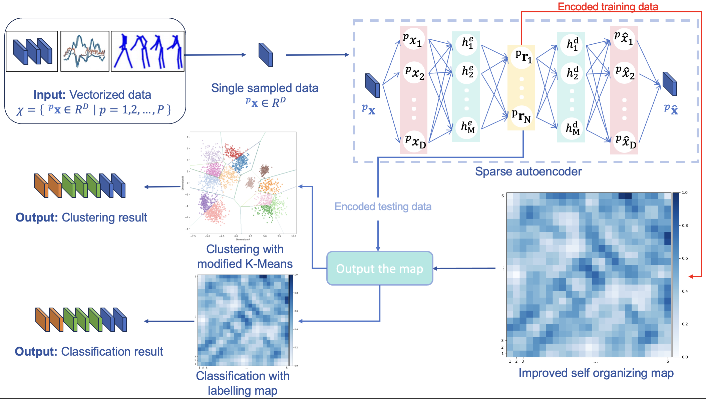

# DualSOM: Dual-mode software for clustering and classification using Self-Organising Map

**Authors:** Xin He¹², Teresa Zielinska², Vibekananda Dutta¹², Takafumi Matsumaru¹, Robert Sitnik²

¹ *Waseda University, Japan*
² *Warsaw University of Technology, Poland*


## 📖 Table of Contents

* [Introduction](#introduction)
* [Key Features](#key-features)
* [Network Architecture](#network-architecture)
* [Installation & Environment](#installation--environment)
* [Data Preparation](#data-preparation)
* [Configuration (`params.json`)](#configuration-paramsjson)
* [Execution and Caching](#execution-and-caching)
* [Cluster Number Selection (`Selection.py`)](#optimal-cluster-selection)
* [Benchmarking with Generic Datasets](#benchmarking-with-generic-datasets)
* [Reference](#reference)

---

## <a id="introduction"></a>✨ Introduction

DualSOM is an open-source, general-purpose software framework for **unsupervised clustering** and **supervised classification** of high-dimensional data within a unified pipeline. The framework combines sparse autoencoding for dimensionality reduction with a self-organising map (SOM) trained using distance-based learning.

A central feature of DualSOM is its **dual-mode operation**, which enables seamless transition between clustering and classification without modifying the model structure. The same trained representation and SOM grid can be used for exploratory data analysis or for label-based recognition, ensuring consistency and reproducibility across tasks.

The software is designed as a **modular and extensible system**, allowing users to configure latent dimensionality, SOM topology, learning schedules, neighbourhood functions, and distance metrics. This flexibility makes it applicable to a wide range of domains involving structured or high-dimensional data, including robotics, human–computer interaction, and multimodal perception.

The framework is domain-independent; however, it has been **demonstrated on human posture recognition from RGB-D skeletal data**, following our previous work presented in RA-L/ICRA 2025 [[1]](#reference) . In this context, posture recognition serves as an example application rather than the primary scope of the software.

## <a id="key-features"></a>🚀 Key Features

* **Dual-mode learning (clustering and classification)**
  A unified framework that supports both **unsupervised clustering** and **supervised classification** within the same model, without requiring any structural changes.
* **Shared representation and model reuse**
  The same latent representation and trained self-organising map (SOM) are used for both modes, enabling seamless transition from exploratory analysis to recognition tasks.
* **Dimensionality reduction via sparse autoencoder**
  High-dimensional input data are transformed into compact and informative latent representations, reducing computational complexity while preserving essential structure.
* **Flexible self-organising map (SOM)**
  Configurable SOM architecture with support for different grid sizes, initialization strategies, and **user-defined distance metrics**, allowing adaptation to diverse data types.
* **Automatic clustering capability**
  Built-in mechanism for selecting the optimal number of clusters from a user-defined range using a modified K-Means approach applied to SOM neurons.
* **Supervised label mapping for classification**
  Efficient classification through neuron-based label maps, where each neuron stores class information derived from training samples.
* **Modular and extensible design**
  Clearly separated components (data handling, encoding, SOM training, post-processing) enable easy customization, extension, and integration into larger systems.
* **Reproducible and configurable pipeline**
  All key parameters (latent dimensionality, learning rates, neighbourhood functions, distance metrics) are explicitly configurable, ensuring reproducibility across experiments.
* **Real-time and low-complexity operation**
  Designed with computational efficiency in mind, making the framework suitable for real-time or resource-constrained applications.
* **Application-independent framework**
  Although demonstrated on human posture recognition from skeletal data, the software is applicable to any structured or high-dimensional dataset, including sensor data, motion capture, and multimodal inputs.

## <a id="network-architecture"></a>🕸️ Network Architecture

<p align="center">
  
</p>

## <a id="how-the-system-works"></a>⚙️ How the System Works

DualSOM is designed as a flexible framework for human posture and activity recognition, supporting both **supervised classification** and **unsupervised clustering**. The system combines a **Sparse Autoencoder (SAE)** for feature extraction with an **Extended Self-Organizing Map (SOM)** for structured data representation and clustering.

### 1. Sparse Autoencoder (SAE)
* **Purpose:** Reduces high-dimensional input data (e.g., skeleton coordinates) to a compact latent representation while preserving essential spatial and relational information.
* **Operation:** Takes raw or preprocessed feature vectors as input and learns an embedding that captures meaningful patterns in the data.
* **Output:** Latent features that serve as input to the DualSOM.

### 2. DualSOM
* **Core Component:** An Extended Self-Organizing Map that processes latent features.
* **Functionality:**
  * **Supervised Mode:** Maps neurons to known class labels, enabling accurate posture classification and evaluation using standard metrics (Accuracy, F1, Precision, Recall).
  * **Unsupervised Mode (Algorithm 2):** Performs K-Means-style regrouping of SOM neurons using angular distance, enabling clustering without labels. Clustering quality is evaluated with metrics like NMI, AMI, Homogeneity, and Completeness.

### 3. Two Training Modes
* **Standard Mode:** Periodic validation is performed during SOM training, producing an accuracy curve to monitor learning progress.
* **Fast Mode:** Skips validation checks for quicker execution, suitable for large datasets or rapid experimentation.

### 4. Data Flow
1. **Load Data:** Reads tabular input data (.csv), optionally with labels.
2. **Preprocess:** Normalizes features, imputes missing values, and encodes labels (if available).
3. **Feature Extraction:** Sparse Autoencoder transforms data into latent space.
4. **SOM Training:** DualSOM organizes latent features onto a 2D map, learning topology-preserving representations.

## <a id="installation--environment"></a>🛠️ Installation Guide

Follow these steps to set up DualSOM on your system.

### 1. Clone the Repository

```bash
git clone [https://github.com/qqwwqwq/DualSOM--SOFTWAREX-.git](https://github.com/qqwwqwq/DualSOM--SOFTWAREX-.git)
cd DualSOM--SOFTWAREX-
```

### 2. Create a Python Environment

It is recommended to use `conda` or `venv` to isolate dependencies:

**Using conda:**
```bash
conda create -n dualsom python=3.8
conda activate dualsom
```

**Using venv:**
```bash
python -m venv dualsom_env
source dualsom_env/bin/activate  # Linux/macOS
dualsom_env\Scripts\activate     # Windows
```

### 3. Install Dependencies

Install required Python packages using `pip` and the `requirements.txt` file:

```bash
pip install --upgrade pip
pip install -r requirements.txt
```

**Minimum Recommended Versions:**
* `numpy >= 1.24`
* `pandas >= 3.0`
* `matplotlib >= 3.8`
* `scikit-learn >= 1.3`
* `scipy >= 1.17`
* `torch >= 2.10`
* `torchvision >= 0.25`
* `tqdm >= 4.66`
* `qiskit >= 2.3` *(optional, for quantum experiments if applicable)*

### 4. Optional: GPU Support

If a CUDA-compatible GPU is available, ensure PyTorch is installed with GPU support to accelerate Sparse Autoencoder training:

```bash
# Example for CUDA 12.2
pip install torch==2.10.0+cu122 torchvision==0.25.0+cu122 -f [https://download.pytorch.org/whl/torch_stable.html](https://download.pytorch.org/whl/torch_stable.html)
```

### 5. Verify Installation

Run a quick test to confirm the environment is correctly set up:

```bash
python -c "import torch, numpy, pandas, matplotlib; print('Environment OK')"
```

---

## <a id="data-preparation"></a>📂 Data Preparation

### Tested Datasets
Our framework is highly flexible. It supports standard vectorized data (`.npy`, `.csv`) and has built-in pipelines specifically tailored and evaluated on 

Two skeleton-based human posture datasets:
* **WUT** (Warsaw University of Technology Dataset)
* **PKU-MMD** (Peking University Dataset)

One image dataset:
* **MNIST** (Standard benchmark dataset of 28x28 grayscale handwritten digits)

One signal dataset:
* **FordA** (Automotive engine noise and vibration sensor time-series dataset from the UCR archive)
  
### 1. Download Datasets
* **WUT Dataset**: Download the skeleton-only dataset from [Link](#).
* **PKU Dataset**: Download the skeleton-only dataset from [Link](#).
* **MNIST Dataset**: Run `python prepare_mnist.py` to automatically download, normalize, and format the image data into compatible CSV files.
* **FordA Dataset**: Run `python prepare_ucr_forda.py` to automatically download and process the 1D sensor time-series data into compatible CSV files.

### 2. Directory Structure
After downloading and extracting, please arrange the raw data into the following directory structure before training:

```text
DualSOM/
├── Datas/
│   ├── WUT/
│   │   ├── train_data.csv       # Preprocessed training features & labels
│   │   ├── test_data.csv        # Preprocessed testing features & labels
│   │   └── wut_label_map.json   # Auto-generated label mapping
│   ├── PKU/
│   │   ├── train_data.csv       # Preprocessed training features & labels
│   │   ├── test_data.csv        # Preprocessed testing features & labels
│   │   └── pku_label_map.json   # Auto-generated label mapping
│   ├── MNIST/
│   │   ├── train_data.csv       # Preprocessed training features & labels
│   │   ├── test_data.csv        # Preprocessed testing features & labels
│   │   └── mnist_label_map.json # Auto-generated label mapping
│   └── FordA/
│       ├── train_data.csv       # Preprocessed training features & labels
│       ├── test_data.csv        # Preprocessed testing features & labels
│       └── forda_label_map.json # Auto-generated label mapping
├── Daulmap.py                   # Core mathematical SOM and clusterer
├── sparse_autoencoder.py        # PyTorch Mini-Batch Autoencoder module
├── preprocessing.py             # Data ingestion and generic loader
├── main.py                      # Main 5-stage execution pipeline
├── Selection.py                 # Tool for finding the optimal cluster number
├── params.json                  # All-in-one configuration file
└── weight/                      # Auto-generated directory for cached models
    ├── sparse_ae.pth
    └── som_weights.npy
```

---

## <a id="configuration-paramsjson"></a>⚙️ Configuration (`params.json`)

To ensure absolute experimental reproducibility, **all hyperparameters, paths, hardware settings, and operational modes are exclusively controlled via a single `params.json` file**. 

If this file is missing, running `python main.py` will automatically generate a template.

### Configuration Template

```json
{
    "dataset_name": "wut",
    "run_mode": "supervised",
    "device": "cuda",
    "train_data_path": "Datas/WUT/train_data.csv",
    "test_data_path": "Datas/WUT/test_data.csv",
    "som_size_index": 10.0,
    "som_epochs": 50,
    "som_sigma": 4.0,
    "som_sigma_target": 0.01,
    "som_lr": 0.1,
    "som_lr_target": 0.001,
    "activation_distance": "angular",
    "som_enable_validation": 1,
    "som_load_model": false,
    "som_model_path": "weight/som_weights.npy",
    "n_clusters": 10,
    "kmeans_max_iter": 100,
    "kmeans_threshold": 0.0001,
    "ae_batch_size": 32,
    "ae_epochs": 150,
    "ae_lr": 0.001,
    "ae_reg_param": 0.001,
    "ae_load_model": false,
    "ae_model_path": "weight/sparse_ae.pth",
    "reduction_factor": 1
}
```

### Parameter Dictionary

| Parameter | Type | Description |
| :--- | :--- | :--- |
| **Workflow & Paths** | | |
| `dataset_name` | String | Dataset identifier (e.g., `"wut"`, `"pku"`, `"mnist"`, `"forda"`).|
| `run_mode` | String | `"supervised"` (classification) or `"unsupervised"` (clustering). |
| `device` | String | Hardware accelerator. Options: `"cuda"`, `"cpu"`. |
| `train_data_path` | String | Local path to the training CSV file. |
| `test_data_path` | String | Local path to the testing CSV file. |
| **Sparse Autoencoder (SAE)** | | |
| `ae_batch_size` | Int | Mini-batch size for optimal gradient convergence. |
| `ae_epochs` | Int | Total number of training epochs for the SAE. |
| `ae_lr` | Float | Learning rate for the Adam optimizer. |
| `ae_reg_param` | Float | Coefficient for the L1 sparsity penalty applied to the latent space. |
| `ae_load_model` | Bool | `true`: Load pre-trained `.pth` weights. `false`: Train from scratch. |
| `ae_model_path` | String | Filepath for saving/loading SAE weights. |
| **DualSOM** | | |
| `som_size_index` | Float | Resolution multiplier. Grid size ($N \times N$) is calculated dynamically. |
| `som_epochs` | Int | Number of epochs for topological training. |
| `som_sigma` / `lr` | Float | Initial values for neighborhood radius and learning rate. |
| `activation_distance`| String | Routing metric. Options: `"angular"`, `"euclidean"`, `"cosine"`. |
| `som_enable_validation`| Int | `1`: Prints periodic accuracy. `0`: Disables prints for max speed. *(Auto-disabled in unsupervised mode)*. |
| `som_load_model` | Bool | `true`: Load converged map weights. `false`: Train from scratch. |
| `som_model_path` | String | Filepath for saving/loading the SOM weight matrix (`.npy`). |
| **Clustering** | | |
| `n_clusters` | Int | Target number of clusters ($K$) for weight-space K-Means. |
| `kmeans_max_iter` | Int | Maximum iterations for K-Means convergence. |
| `kmeans_threshold`| Float | Convergence threshold (centroid shift) for K-Means. |

---

## <a id="execution-and-caching"></a>🚀 Execution and Caching

The pipeline is completely JSON-driven. When executing `python main.py`, the script sequentially processes the workflow exactly as described in the paper. Below is the core logic mapped directly to the implementation:

### Quick Start Commands

#### 1. Standard Training
Configure your dataset paths in `params.json`, ensure `ae_load_model` and `som_load_model` are set to `false`, and run:
```bash
python main.py
```

#### 2. Instant Re-evaluation (Using Cached Models)
Our framework explicitly separates training from inference. After the first run, model weights are saved to the `weight/` directory. To rapidly test a different scenario (e.g., switching to `"unsupervised"` mode):
1. Set `"run_mode": "unsupervised"` and `"n_clusters": <desired_number>` in `params.json`.
2. Set `"ae_load_model": true` and `"som_load_model": true`.
3. Run `python main.py`.

*The pipeline will bypass training blocks and output clustering metrics in seconds.*

---

## <a id="optimal-cluster-selection"></a>🔎 Cluster number Selection (`Selection.py`)

When operating in **unsupervised mode**, selecting the optimal number of clusters ($K$) can be challenging. To assist with this, we provide `Selection.py`, a dedicated utility tool that mathematically determines the best $K_m$ using the Angular Distance Criterion $\Delta L(k)$ introduced in our framework.

### How It Works
`Selection.py` acts as a dry-run evaluator. It **bypasses any training** by loading the pre-trained weights from `main.py`, evaluates a user-defined range of $k$ values via spherical K-Means, and plots the absolute difference metric $\Delta L(k) = |L(k) - L(k-1)|$. The optimal cluster number minimizes this difference.

### Usage
**Prerequisite:** You must have run `main.py` at least once so that the model weights are successfully saved in the `weight/` directory.

Run the script from the terminal, specifying the minimum and maximum range of clusters you want to evaluate:
```bash
python Selection.py --k_min 2 --k_max 12
```

### Workflow Integration
1. Train your model using `main.py`.
2. Run `python Selection.py --k_min 2 --k_max 12`.
3. Check the terminal output and the generated visual plot for the **"Recommended Optimal Cluster Number (Km)"**.
4. Update the `"n_clusters"` field in your `params.json` with this recommended $K_m$.
5. Run `main.py` in `"unsupervised"` mode to get the final clustered outputs.

---

## <a id="benchmarking-with-generic-datasets"></a>🎯 Benchmarking with Generic Datasets

To evaluate the pipeline on standard benchmarks, use the provided preparation scripts to generate standardized CSV files. Once the data is prepared, the generic pipeline treats them as standard feature vectors.

### 1. MNIST (Image Data)
1. **Generate Data**: Run `python prepare_mnist.py`. This will create normalized 784-dimensional feature CSVs in `Datas/MNIST/`.
2. **Update Configuration**: In `params.json`, point the data paths to the new files:
   - `"train_data_path": "Datas/MNIST/train_data.csv"`
   - `"test_data_path": "Datas/MNIST/test_data.csv"`
3. **Run**: `python main.py`

### 2. FordA (1D Signal Data)
1. **Generate Data**: Run `python prepare_ucr_forda.py`. This will fetch and format the 500-dimensional sensor time-series into `Datas/FordA/`.
2. **Update Configuration**: In `params.json`, set the paths to the FordA CSV files:
   - `"train_data_path": "Datas/FordA/train_data.csv"`
   - `"test_data_path": "Datas/FordA/test_data.csv"`
3. **Run**: `python main.py`

*The framework will ingest these prepared CSVs, compress the high-dimensional signals/pixels through the Sparse Autoencoder, and project them onto the DualSOM grid automatically.*

---

## <a id="reference"></a>📜 Reference

[1] Xin He, Teresa Zielinska, Vibekananda Dutta, Takafumi Matsumaru, and Robert Sitnik. "From Seeing to Recognising–An Extended Self-Organizing Map for Human Postures Identification." *IEEE Robotics and Automation Letters*, vol. 9, no. 9, pp. 7899-7906, 2024.

```bibtex
@ARTICLE{10608412,
  author={He, Xin and Zielinska, Teresa and Dutta, Vibekananda and Matsumaru, Takafumi and Sitnik, Robert},
  journal={IEEE Robotics and Automation Letters}, 
  title={From Seeing to Recognising–An Extended Self-Organizing Map for Human Postures Identification}, 
  year={2024},
  volume={9},
  number={9},
  pages={7899-7906},
  doi={10.1109/LRA.2024.3433201}
}
